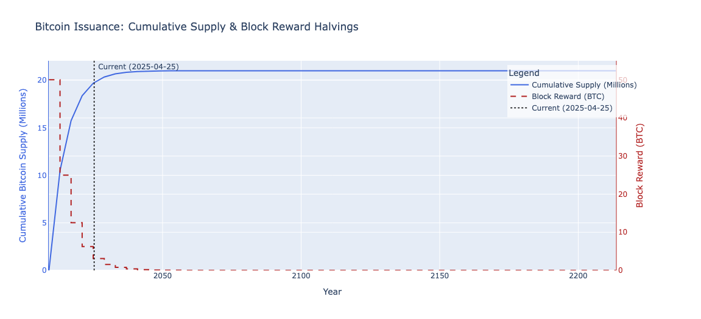

# ⏳ Bitcoin-Issuance-Schedule-Visualiser <a href="https://www.python.org/" target="_blank" rel="noreferrer"> **Python** </a>

This Python script calculates and visualises Bitcoin's historical and future issuance schedule, illustrating the impact of halving events on block rewards and the cumulative supply approaching the 21 million cap.

## 🧾 Description

This script provides a clear view of Bitcoin's deflationary monetary policy as defined by its protocol rules. It does not connect to the live blockchain but instead calculates the issuance trajectory based on:
1.  The **Genesis Block date** (approx. 2009-01-03).
2.  An **average block time** of 10 minutes.
3.  The **halving event** occurring every 210,000 blocks.
4.  The **initial block reward** of 50 BTC, halving subsequently.
5.  The **maximum supply** capped at 21,000,000 BTC.

The script dynamically calculates the estimated current state (blocks mined, BTC issued) based on the current time. It presents:
* A status summary in the terminal (current mined supply, blocks, time until ~2140).
* A formatted table showing details for each halving epoch.
* An **interactive chart** generated using **Plotly**, displaying:
    * The cumulative Bitcoin supply curve over time.
    * The step-down progression of block rewards at each halving.
    * The current date marked clearly on the timeline.

This project serves as an educational tool to understand the mechanics of Bitcoin's predetermined supply schedule.

## 🚀 Features

- Calculates the theoretical Bitcoin issuance schedule from 2009 to ~2140+.
- Estimates current mined supply and block number based on elapsed time.
- Displays current status, formula, countdown, and detailed halving table in the terminal.
- Generates a rich, **interactive Plotly chart** visualizing:
    - Cumulative supply curve approaching the 21M cap.
    - Step-wise decrease in block rewards (halvings).
    - Dual Y-axes for supply (Millions) and reward (BTC).
    - Coloured axes and titles matching the data series.
    - Current date marked with a vertical line and included in the legend.
    - Hover-over details for precise data points.
    - Zoom and pan functionality.
- Chart includes a clear legend for all plotted elements.

## 📦 Requirements

* Open the Notebook: Click the badge to open this notebook directly in Google Colab: [](https://colab.research.google.com/github/tunjis/Data-Analysis-Visualisation_Excel/blob/main/bitcoin_halving_supply_visualiser.ipynb)
* Required Python libraries:
    * `plotly`
    * `python-dateutil`
    * `tabulate`

## 🛠 Usage

1.  **Save the Code:**
    * Save the Python script provided earlier to a file named `bitcoin_issuance_plotly.py` (or your preferred name).
2.  **Install Libraries:**
    * Open your terminal or command prompt and run:
        ```bash
        pip install plotly python-dateutil tabulate
        ```
3.  **Run the Script:**
    * Navigate to the directory where you saved the file in your terminal and execute the script:
        ```bash
        python bitcoin_issuance_plotly.py
        ```
4.  **View Output:**
    * The script will print the status summary and the issuance table to your terminal.
    * An interactive Plotly chart will automatically open in your default web browser or integrated viewer (like in VS Code). You can interact with this chart (zoom, pan, hover, save).

## 📊 Example Output

An interactive chart will be displayed. Here's a placeholder for what it looks like:

*(Suggestion: Run the script, take a screenshot of the Plotly chart, save it as `issuance_plot.png` in the same directory, and update the line above)*

-------------

* ⚠️ **Disclaimer:** This tool is for educational and illustrative purposes only. The calculations are based on theoretical protocol rules and an average block time, not live blockchain data. It **does not constitute financial or investment advice**. Bitcoin's future price and network behaviour involve significant complexity and risk beyond this simple issuance model.*

### 🧑‍💻 Created by [tunjis](https://github.com/tunjis)

*(You can replace `[tunjis]` with your GitHub username if desired)*

-------------

* 🌍 Based in <a href="https://maps.app.goo.gl/hMxhRX5ptQAAkL7NA/" target="_blank">**London**</a>
* 📫 Contact me via my [LinkedIn profile](https://linkedin.com/in/justincraciun/)
* *(Feel free to add/remove personal details as you see fit)*

-------------

### 🔁 Socials

*(Adapt links or remove if not needed)*

<a href="https://www.github.com/tunjis/" target="_blank" rel="noreferrer">
 <picture>
   <source media="(prefers-color-scheme: dark)" srcset="https://raw.githubusercontent.com/danielcranney/readme-generator/main/public/icons/socials/github-dark.svg" />
   <source media="(prefers-color-scheme: light)" srcset="https://raw.githubusercontent.com/danielcranney/readme-generator/main/public/icons/socials/github.svg" />
   
 </picture>
</a>
<a href="https://linkedin.com/in/justincraciun/" target="_blank" rel="noreferrer">
 <picture>
   <source media="(prefers-color-scheme: dark)" srcset="https://raw.githubusercontent.com/danielcranney/readme-generator/main/public/icons/socials/linkedin-dark.svg" />
   <source media="(prefers-color-scheme: light)" srcset="https://raw.githubusercontent.com/danielcranney/readme-generator/main/public/icons/socials/linkedin.svg" />
   
 </picture>
</a>

-------------

### ☕ Support Me

*(Optional: Add your support link if you have one)*
